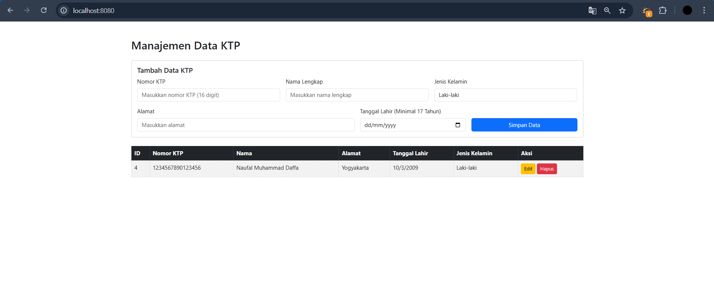

# Screenshot

## Output UI

| Keterangan | Screenshot |
|------------|------------|
| Tampilan UI di localhost |  |

---

# Documentation: KTP API Spec

## Create KTP

Endpoint : POST `/api/ktp`

Request Body :

```json
{
  "nomorKtp": "3175091203980001",
  "namaLengkap": "Naufal Muhammad Daffa",
  "alamat": "Jakarta",
  "tanggalLahir": "2003-03-12",
  "jenisKelamin": "Laki-laki"
}
```

Response Body 
Success, 201 Created :

```json
{
  "data": {
    "id": 1,
    "nomorKtp": "3175091203980001",
    "namaLengkap": "Naufal Muhammad Daffa",
    "alamat": "Jakarta",
    "tanggalLahir": "2003-03-12T00:00:00.000Z",
    "jenisKelamin": "Laki-laki"
  },
  "status": "success"
}
```

Error, 400 Bad Request :

```json
{
  "message": "Nomor KTP sudah ada",
  "status": "error"
}
```

---

## Get All KTP

Endpoint : GET `/api/ktp`

Response Body (Success, 200 OK) :

```json
{
  "data": [
    {
      "id": 1,
      "nomorKtp": "3175091203980001",
      "namaLengkap": "Naufal Muhammad Daffa",
      "alamat": "Jakarta",
      "tanggalLahir": "2003-03-12T00:00:00.000Z",
      "jenisKelamin": "Laki-laki"
    }
  ],
  "status": "success"
}
```

---

## Get KTP By ID

Endpoint : GET `/api/ktp/{id}`

Example :
GET `/api/ktp/1`

Response Body (Success, 200 OK) :

```json
{
  "data": {
    "id": 1,
    "nomorKtp": "3175091203980001",
    "namaLengkap": "Naufal Muhammad Daffa",
    "alamat": "Jakarta",
    "tanggalLahir": "2003-03-12T00:00:00.000Z",
    "jenisKelamin": "Laki-laki"
  },
  "status": "success"
}
```

Error, 400 Bad Request :

```json
{
  "status": "error",
  "message": "Data tidak ditemukan"
}
```

---

## Update KTP

Endpoint : PUT `/api/ktp/{id}`

Example :
PUT `/api/ktp/1`

Request Body :

```json
{
  "nomorKtp": "3175091203980002",
  "namaLengkap": "Naufal Daffa",
  "alamat": "Bandung",
  "tanggalLahir": "2003-03-12",
  "jenisKelamin": "Laki-laki"
}
```

Response Body:
Success, 200 OK :

```json
{
  "data": {
    "id": 1,
    "nomorKtp": "3175091203980002",
    "namaLengkap": "Naufal Daffa",
    "alamat": "Bandung",
    "tanggalLahir": "2003-03-12T00:00:00.000Z",
    "jenisKelamin": "Laki-laki"
  },
  "status": "success"
}
```

Error, 400 Bad Request :

```json
{
  "message": "Nomor KTP sudah digunakan",
  "status": "error"
}
```
```json
{
  "status": "error",
  "message": "Data tidak ditemukan"
}
```

---

## Delete KTP

Endpoint : DELETE `/api/ktp/{id}`

Example :
DELETE `/api/ktp/1`

Response Body (Success, 200 OK) :

```json
{
  "status": "success delete ktp with id 1"
}
```

Error, 400 Bad Request :

```json
{
  "status": "error",
  "message": "Data tidak ditemukan"
}
```
